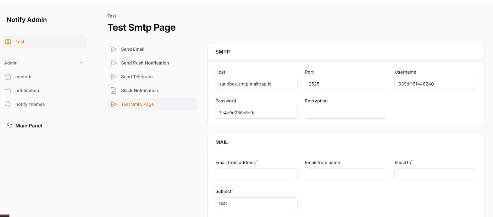

# Test smtp page

E' possibile testare una qualsiasi configurazione smtp tramite la questa pagina di test.

Il sistema rileverà in automatico la configurazione di default, ma si potrà benissimo cambiarla in modo da provarne altre.

Inseriti le varie impostazioni, si potrà verificare il funzionamento di una determinata configurazione email.